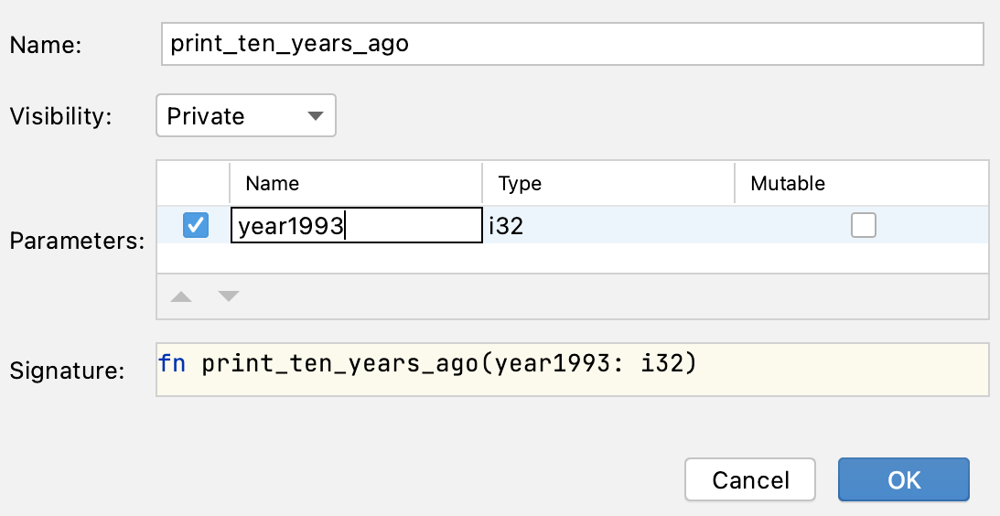

## IDE 마스터하기: 메서드 추출 리팩토링

개발자는 이 작업에서 보이는 코드의 메시지 형식을 변경하라는 요청을 받았습니다.

현재는 "1993: 10 years ago was 1983"로 출력되지만, 이제 "1993: ten years ago was 1983"로 출력되기를 원합니다.

하지만 현재 방식으로는 개발자가 메시지를 두 군데에서 수정해야 하며, 이 코드가 더 많은 곳에서 사용될 경우 더 불편해질 것입니다.

그래서 메시지 형식을 실제로 변경하기 전에, 개발자는 리팩토링을 수행하여 메시지를 출력하는 함수를 만들기로 결심했습니다.

### 작업

**1단계: 함수 생성**

리팩토링을 수행하여 중복된 코드를 대체할 새 함수를 생성합니다.

다음 코드의 첫 번째 사용 부분을 선택하세요.

```rust
println!("{}: 10 years ago was {}", year1993, year1993 - 10);
```

그리고 &shortcut:ExtractMethod; 키를 누르거나, 오른쪽 클릭 메뉴에서 *Refactor -> Extract Method...*를 선택하세요.

팝업 대화창에서 매개변수에 더 적절한 이름(예: year)을 선택할 수 있습니다.



**2단계: 중복 코드 교체**

새 함수를 생성한 후, 코드의 두 번째 사용 부분을 새 함수 호출로 교체하세요.

**3단계: 텍스트 변경**

마지막으로, 함수 본문에서 "10"을 "ten"으로 수정하세요.