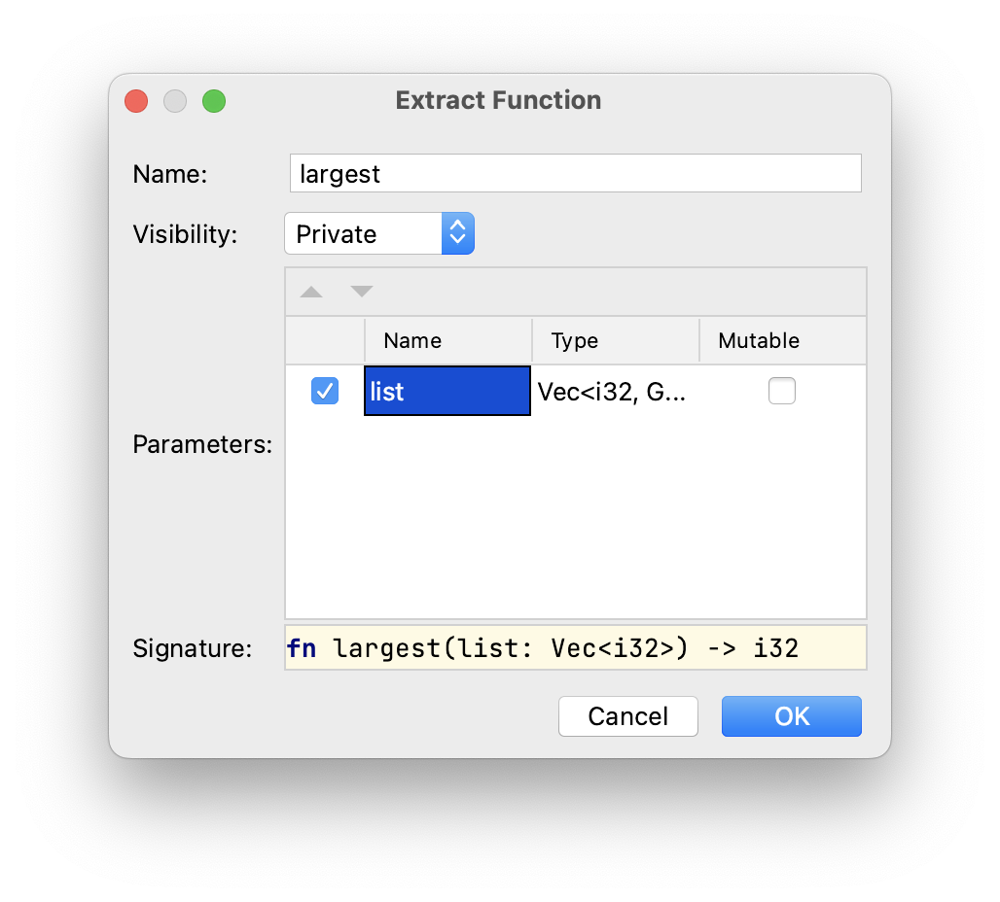

## 리팩토링으로 중복 제거하기

중복을 제거하기 위해, 매개변수로 전달된 정수 리스트에 대해 작동하는 함수를 정의하여 추상화를 생성할 수 있습니다. 이 솔루션은 코드의 가독성을 높이고, 리스트에서 가장 큰 숫자를 찾는 개념을 추상적으로 표현할 수 있게 해줍니다.

우리는 %IDE_NAME%에서 제공하는 다양한 리팩토링을 사용하여 여러 단계에 걸쳐 이를 실현할 수 있습니다.

### 1단계: 함수 추출하기

편집기에서 4번째 줄부터 시작하는 첫 번째 프레임을 확인하세요. 프레임 전체를 선택한 후 &shortcut:ExtractMethod;를 누르거나, 오른쪽 클릭 메뉴에서 *리팩터 -> 메서드 추출...*을 선택하세요.

함수 이름을 `largest`로 입력하고 매개변수 이름을 `list`로 변경하세요:



이 명령을 실행하면 전체 코드 조각이 다음과 같은 한 줄로 대체됩니다:

```rust
let largest = largest(number_list);
```

추출된 함수는 `main` 함수 아래에 추가된 것을 확인할 수 있습니다:

```rust
fn largest(list: Vec<i32>) -> i32 {
    let mut largest = list[0];

    for number in list {
        if number > largest {
            largest = number;
        }
    }
    largest
}
```

코드는 여전히 이전과 동일한 결과로 컴파일되고 실행됩니다.

### 2단계: 변수 이름 변경

이름 충돌을 방지하기 위해 몇몇 변수의 이름을 변경해봅시다:

- `largest` 변수의 첫 번째 바인딩(4번째 줄)을 `result`로 변경합니다.
- `largest` 변수의 두 번째 바인딩도 `result`로 변경합니다.

이 작업을 수행하려면, 변수에 포인터를 맞춘 후 &shortcut:RenameElement;를 누르거나 *리팩터 -> 이름 변경...*을 선택하세요. 더 자세한 내용은 [이 리팩토링을 소개하는 작업](course://Common Programming Concepts/Variables/Introduce Variable Refactoring)을 참고하세요.

### 3단계: 중복된 코드 조각 대체하기

편집기에서 네 번째 프레임 전체를 선택한 다음, 또 다른 `largest` 함수 호출인 `largest(number_list);`로 대체하세요.

이 시점에서, 두 번째 `result` 바인딩에 대한 `mut` 수정자를 제거할 수도 있습니다. 더 이상 필요하지 않습니다.

### 4단계: 타입 조정

매개변수를 조금 더 일반적으로 만들고 싶다면, 함수 정의에서 `Vec<i32>`를 슬라이스에 대한 참조인 `&[i32]`로 대체해보세요. 이 변경은 몇 가지 컴파일 오류를 발생시키지만, `fn largest` 호출부의 `number_list` 변수와 함수 정의 내부의 `for` 루프에서의 `number` 변수에 각각 `&`를 추가하여 수정할 수 있습니다.

이 변경은 동일한 함수를 벡터, 배열 및 어떤 형태의 `i32` 슬라이스에도 사용할 수 있도록 해줍니다.