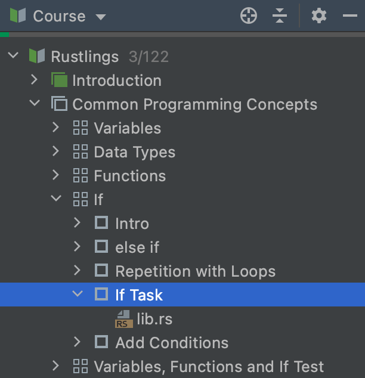

## 코스 보기

<b>코스 보기</b>는 강의 계획서를 보여줍니다: 작업이 포함된 강의 목록입니다.

작업 이름을 더블 클릭하면 해당 작업으로 이동할 수 있습니다.

코스 보기 창을 숨기려면 Project Tool Window 버튼을 클릭하거나 &shortcut:ActivateProjectToolWindow;를 누르세요. 이렇게 하면 Editor와 Task Description 창을 위한 공간이 더 생깁니다.

숨겨진 코스 보기 창을 다시 표시하려면 Project Tool Window 버튼을 클릭하거나 &shortcut:ActivateProjectToolWindow;를 다시 누르세요.