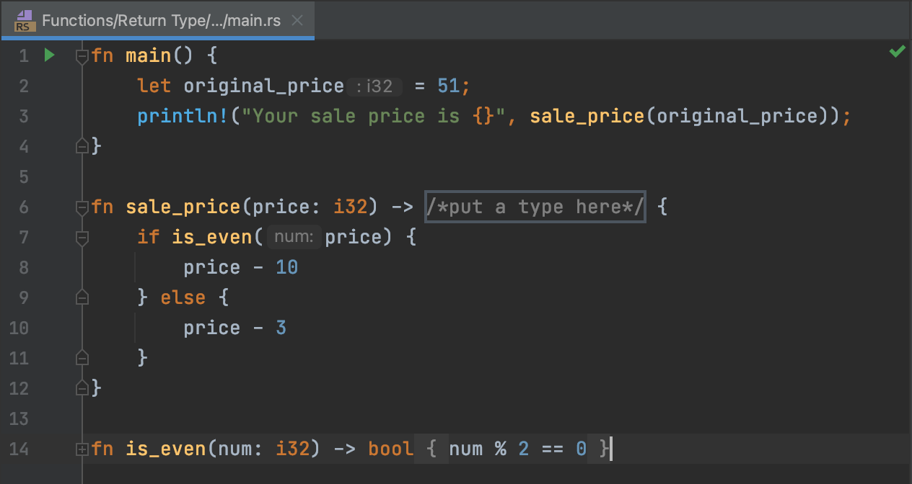
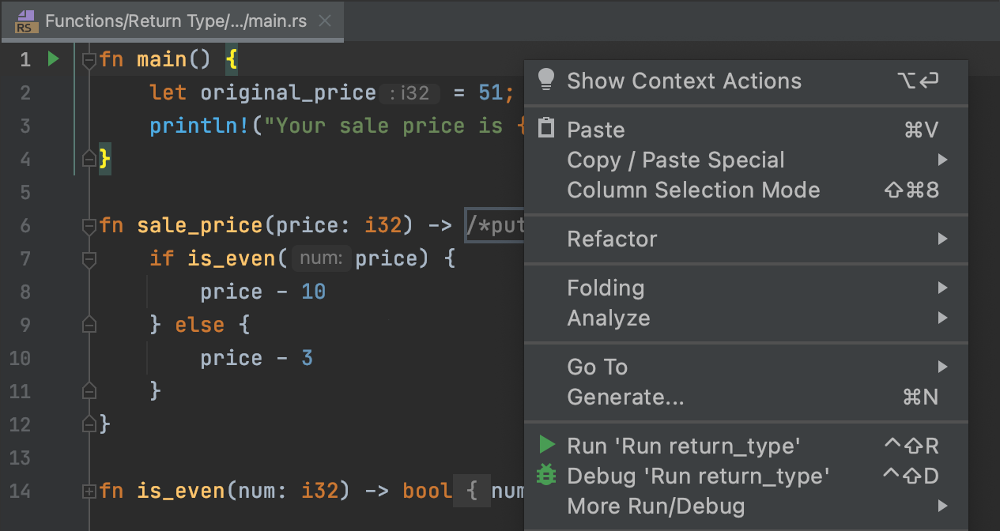

## 편집기

<b>편집기</b>는 여러분이 프로그래밍을 할 수 있는 놀이터입니다. 이곳에서 이론 과제와 퀴즈를 작업하면서 검사받지 않고 실험할 수 있습니다.

프로그래밍 과제를 수행할 때, 편집기는 기존 코드를 수정하거나 처음부터 새로운 코드를 작성하는 공간입니다. 여기서 작성한 코드는 검사됩니다.

언제든 코드를 실행하려면, 컨텍스트 메뉴에서 실행(Run) 옵션을 선택하거나 &shortcut:Run; 키를 누르세요:

`main()` 함수(이는 `main.rs` 파일에 포함되어 있으며, 모든 과제에 반드시 존재하는 것은 아닙니다)를 실행하면 코드가 어떤 출력 결과를 생성하는지 확인할 수 있어 유용할 때가 있습니다. 편집기로 돌아가 코드에 집중하고 싶다면, 가장 빠른 방법은 모든 창 숨기기(Hide All Windows) 명령 (&shortcut:HideAllWindows;)을 사용하는 것입니다. 모든 창을 다시 표시하려면 동일한 명령을 반복하면 됩니다.