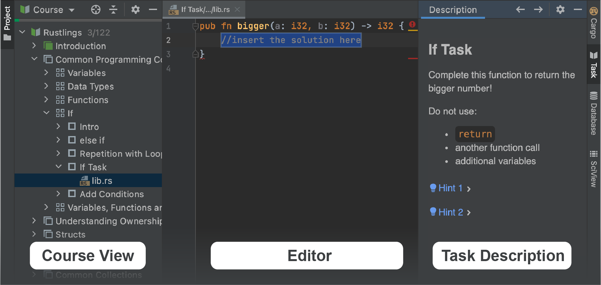

## JetBrains Academy 플러그인 개요

이 수업은 [JetBrains Academy 플러그인](https://www.jetbrains.com/help/education/educational-products.html)을 사용하여 Rust를 배우기 위한 첫걸음을 도울 것입니다.

JetBrains Academy 플러그인을 사용하면 코딩 과제를 완수하며 프로그래밍 언어와 도구를 학습할 수 있고, IDE 내에서 즉각적인 피드백을 받을 수 있습니다.

이제 설명은 충분하니 시작해 봅시다!

인터페이스에 이미 익숙하다면 이 수업을 건너뛸 수 있습니다.

### 코스와 함께 작업하기
JetBrains Academy에서 이용 가능한 모든 코스는 레슨 목록으로 구성됩니다. 레슨은 다시 섹션으로 그룹화될 수 있습니다. 각 레슨은 여러 가지 과제를 포함하고 있습니다.

코스를 열면 주로 탐색에 사용되는 주요 도구 창을 볼 수 있습니다: <b>Course View</b>, <b>Editor</b>, 그리고 <b>Task Description</b>:

"Next" 버튼을 클릭하여 다음 과제로 이동하세요.