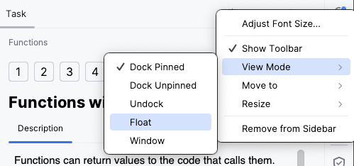

## 작업 설명

**작업 설명** 창은 작업을 완료하는 데 필요한 모든 정보를 제공합니다:

이론적인 작업의 경우, 설명에는 학습 및 읽기 자료가 포함됩니다.  
퀴즈의 경우, 설명에는 다중 선택 질문이 포함됩니다.  
프로그래밍 과제의 경우, 해결해야 할 문제를 제시합니다.

다음 동작을 위해 작업 설명 창의 요소를 사용하세요:

| 요소                                                              | 설명                                                                                                                   |
|------------------------------------------------------------------|-------------------------------------------------------------------------------------------------------------------------|
| **Check (확인)**                                                  | 대답(퀴즈의 경우) 또는 코드 솔루션(프로그래밍 작업의 경우)의 정답 여부를 확인합니다                  |   
| **Run (실행)**                                                    | 코드를 실행합니다 (이론 작업의 경우)                                                              |
|                                              | 이전 작업으로 이동                                                                                |    
|  &nbsp;또는 **Next (다음)** | 다음 작업으로 이동                                                                               | 
|                                             | 해당 작업에서 수행한 모든 변경 사항을 취소하고 처음부터 다시 시작합니다                              | 
|                                       | 특정 작업에 대한 의견을 남깁니다                                                                 | 
| <a>Peek Solution...</a>                                          | 정답을 공개하고 <b>차이점(diff)</b>을 표시합니다                                                  |

작업 설명 창을 완전히 숨기지 않고 계속 표시해 두는 것이 좋습니다. 만약 너무 산만하다면, 작업 설명 창의 오른쪽 상단 구석에 있는  버튼을 클릭하여 숨길 수 있습니다.

두 대의 모니터를 사용하는 경우, 작업 설명 패널을 플로팅 모드로 전환한 뒤 두 번째 모니터로 이동하거나 주요 IDE 창 근처에 배치하는 것이 도움이 될 수 있습니다. 이를 수행하려면 도구 창 설정  아이콘을 클릭하세요:

